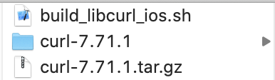

# curl7.71-iOS上的编译
[[toc]]

## 一. 下载代码

进入[curl gthub](https://github.com/curl/curl)下载github的release版本的代码如下,我们使用的是7.71.1版本



## 二. 使用脚本
```objc
sh build_libcurl_ios.sh
```

## 三. 如果要编译curl其他版本参考
1.[curl docs](https://github.com/curl/curl/tree/master/docs)   
2.[curl官网](https://curl.haxx.se/libcurl/c/CURLOPT_HTTP_VERSION.html)

## 常见问题
网上其他脚本容易出现
```objc
Can't cross-compile for iOS on macOS 10.15
```    

[Can't cross-compile for iOS on macOS 10.15 #4367
](https://github.com/curl/curl/issues/4367)

这里使用这个脚本不用出现问题，原因是编译要cd到curl里面去，配置目录会有问题导致。并不是上述的问题